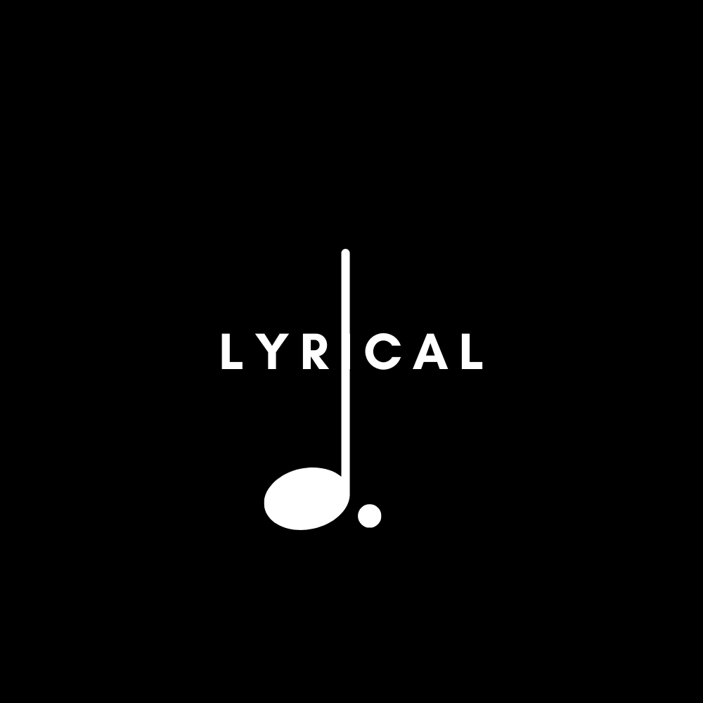

# 🎼 Lyrical

<div align="center">
	
</div>

<br>

<div align="center">
   
   
   <br>
   
</div>

## 📖 Overview

Lyrical is an end-to-end Lyrics Generation Model that leverages the power of recurrent neural networks (RNNs) and natural language processing to learn the patterns, structure, and vocabulary of song lyrics. By training on a diverse collection of lyrics from different genres and artists, the model can capture the nuances and characteristics of various music styles and intelligently generate lyrics that adhere to specific themes, genres, or even mimic the style of a particular artist.

## ➕ Features

- **Data Collection**: The model incorporates a web scraping component to collect song lyrics from popular online platforms such as Genius Lyrics. The lyrics, along with associated metadata such as artist name, song title, genre, and album, are gathered to provide additional context for conditioning the model during the generation process.
- **Data Preprocessing**: The collected lyrics are meticulously preprocessed to ensure data quality and consistency. This includes removing irrelevant information, handling missing values, standardizing text formatting, and performing other data cleaning tasks. The lyrics are also tokenized and converted into numerical representations suitable for training the lyrics generation model.
- **Conditioning and Context**: The model takes advantage of the additional metadata, such as genre, artist name, and album, to condition the generated lyrics. By providing these conditioning factors during the training and generation phases, the model can generate lyrics that align with specific styles, themes, or artists, producing more contextually relevant and coherent results.
- **Model Training**: The lyrics generation model employs advanced deep learning techniques, such as recurrent neural networks (RNNs) or transformer architectures, to learn the underlying patterns and structures within the lyrics dataset. The model is trained using techniques like sequence-to-sequence modeling or language modeling approaches, optimizing it to generate meaningful and creative lyrics.
- **Evaluation and Fine-tuning**: The generated lyrics can be evaluated using metrics such as perplexity, BLEU score, or through human evaluation. This evaluation process helps fine-tune the model by iteratively adjusting hyperparameters, experimenting with different architectures, and training strategies to optimize the results and enhance the quality and creativity of the generated lyrics.
- **Lyrics Generation**: Once trained, the model can generate new lyrics by providing a seed input or prompt along with the desired conditioning information. The model uses the learned patterns and structures from the training dataset to generate lyrics that are coherent, stylistically appropriate, and aligned with the provided conditioning factors.

## 🌳 Organization

    ├── LICENSE				<- MIT License
    ├── Makefile           			<- Makefile with commands like`make data` or `make train`
    ├── README.md          			<- The top-level README for developers using this project. (you are here!)
    ├── data
    │   ├── features 	     		<- Extracted Features from the preprocessed dataset.
    │   ├── processed      			<- Preprocessed Dataset.
    │   └── raw            			<- Raw Dataset.
    │
    ├── models             			<- Trained and serialized models, model predictions, or model summaries
    │
    ├── notebooks          			<- Jupyter notebooks. Naming convention is a version number (for ordering), my first name, and a short `-` delimited description, e.g. `1.0-syed-initial_data_exploration`.
    │
    ├── reports            			<- Generated analysis as HTML, PDF, LaTeX, etc.
    │
    ├── requirements.txt   			<- The requirements file for reproducing the analysis environment
    │
    └── src                			<- Source code for use in this project.
         ├── __init__.py    		<- Makes src a Python module
         │
         ├── data           		<- Scripts to download data & preprocess it
	     │   ├── make_raw.py		<- Script that downloads data from Kaggle
         │   └── make_processed.py		<- Script that preprcocesses the downloaded data
         │
         ├── features       		<- Scripts to turn raw data into features for modeling
         │   └── build_features.py
         │
         ├── models         		<- Scripts to train models and then use trained models to make predictions
         │   ├── predict_model.py
         │   └── train_model.py
         │
         └── visualization  		<- Scripts to create exploratory and results oriented visualizations
             └── visualize.py

## 🖲️ Installation

To set up Lyrical, follow the instructions below:

1. Clone the repository:

```bash
git clone https://github.com/syedaddan/lyrical.git
```

2. Navigate to the project directory:

```bash
cd lyrical
```

3. Create a virtual environment (optional but recommended):

```bash
python3 -m venv env
```

4. Activate the virtual environment:

```bash
source env/bin/activate
```

5. Install the required dependencies:

```bash
pip install -r requirements.txt
```

6. Make sure you have make installed in your system (if you don't or if your system doesn't support it, you can run the alternative commands to run the project)

## 💻 Usage

The Lyrics Generation Model can be used as follows:Preprocess the dataset:

1. Data Preprocessing:

   - Follow these steps to configure your Kaggle API key (this step is crucial for training the model)

     - Go to the Kaggle website ([https://www.kaggle.com](https://www.kaggle.com/)) and sign in to your account.
     - Click on your profile picture in the top-right corner and select "My Account" from the dropdown menu.
     - Scroll down to the "API" section and click on "Create New API Token". This will download a file named "kaggle.json" containing your API credentials.
     - Place the downloaded "kaggle.json" file in the appropriate directory. If you're using Windows, it should be placed in: `C:\Users\<your-username>\.kaggle\`. On macOS and Linux, it should be placed in: `~/.kaggle/`.
   - Run the following command:

     ```bash
     make data
     ```
     OR (alternative commands)
     ```bash
     python src/data/make_raw.py
     python src/data/make_processed.py
     python src/features/build_features.py
     ```
   - This/these command(s) will fetch the dataset, preprocess it and will extract features from it as well.
   - The raw dataset will be saved in the `data/raw` directory.
   - The processed dataset will be saved in the `data/processed` directory.
   - The extracted features will be saved in the `data/features` directory.
2. Train the model:

   - Customize the model configuration in the `src/models/train_model.py` script.
   - Run the following command:
     ```bash
     make train
     ```
     OR (alternative commands)
     ```bash
     python src/models/train_model.py
     ```
   - The trained model(s) will be saved in the `models` directory.
3. Testing Model:

   - Customize the generation settings in the `src/models/predict_model.py` script.
   - Run the following command:

     ```bash
     make generate
     ```
   - This command will display a number of models trained to generate lyrics from and will prompt you to select one.
   - Alternatively, you can rn this 
   - The generated lyrics will be displayed or saved, depending on the configuration.

## 👨‍👩‍👧‍👦 Contributors

<a href="https://github.com/syedaddan/Python/graphs/contributors">
  
</a>

## 💫 Reach Out

<div align="center">
   <table>
      <tbody>
         <tr>
               <td>
                  <a href="https://www.linkedin.com/in/syedaddan/">
                     
                  </a>
               </td>
               <td>
                  <a href="https://github.com/SyedAddan">
                     
                  </a>
               </td>
               <td>
                  <a href="https://discordapp.com/users/557548825154420737">
                     
                  </a>
               </td>
         </tr>
      </tbody>
   </table>
</div>

## 📃 License

This project is licensed under the MIT License. See the [LICENSE](LICENSE) file for more information.

With Lyrical, you can embark on a creative journey of generating unique song lyrics that capture the essence of different music genres, artists, and themes. Let your imagination flow and dive into the world of AI-assisted lyrics creation!

Happy lyrics generation! 💗
